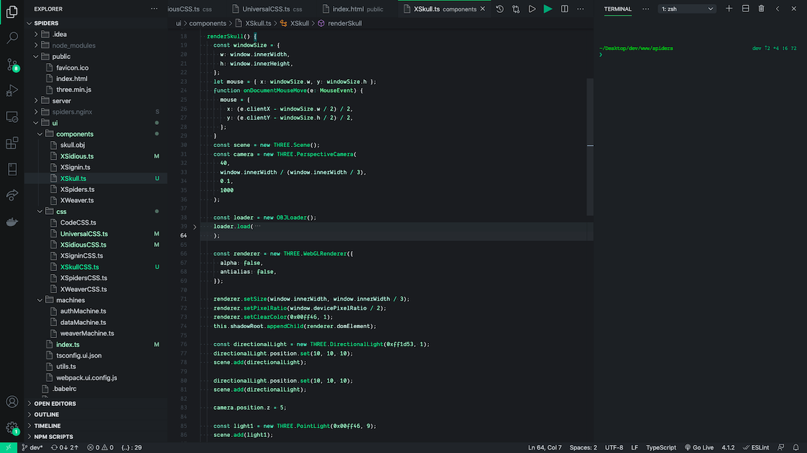
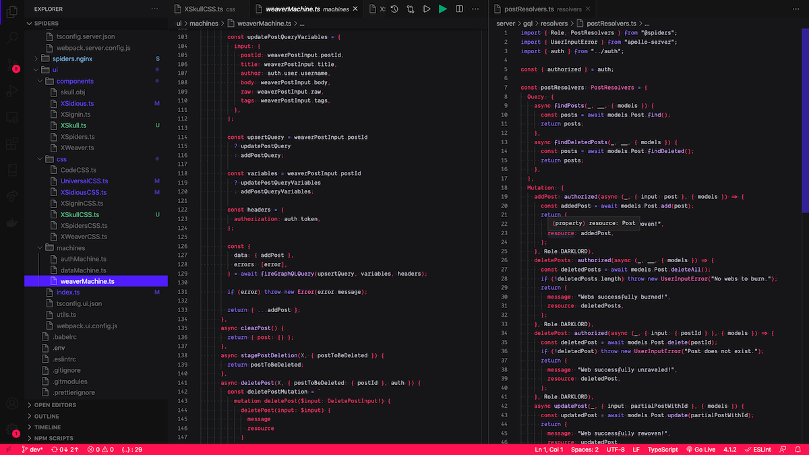

## 🎉 🔥 📟 😈 Sidious Party Theme Pack 

By [sidiousvic](sidious.pizza)

### `DARKLORD`

### `PHANTOM`

## 💾 Installation

1.  Install [Visual Studio Code](https://code.visualstudio.com/)
2.  Launch Visual Studio Code
3.  Choose **Extensions**
4.  Search for `sidious party`
5.  Click **Install**
6.  Click **Reload**
7.  Set your theme to **`PHANTOM`** or **`DARKLORD`**

## 🐛 Bugs

If you find any wicked things, please [file an issue](https://github.com/sidiousvic/sidious-vscode-theme/issues).
